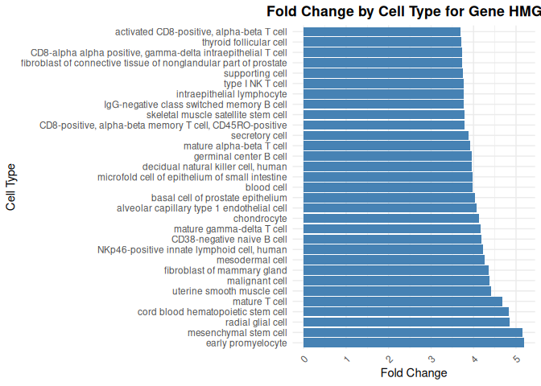

genular
================
Ivan Tomic <info@ivantomic.com>

<!-- README.md is generated from README.Rmd. Please edit that file -->

The goal of `genular` is to provide a comprehensive toolkit for
interacting with the [Genular
API](https://genular.atomic-lab.org/api-docs/), facilitating the
retrieval and analysis of genomic data directly within R.

## Installation

You can install the released version of `genular` from
[CRAN](https://CRAN.R-project.org) with:

``` r
install.packages("genular")
```

Or you can install `genular` directly from GitHub with use of following
commands:

``` r
install.packages("devtools")
devtools::install_github("atomiclaboratory/genular-database", subdir = 'libraries/genular-api/R-package')
```

## Usage Example

``` r
# Check if plyr is installed and install it if necessary
if (!requireNamespace("plyr", quietly = TRUE)) {
  install.packages("plyr")
}
if (!requireNamespace("dplyr", quietly = TRUE)) {
  install.packages("dplyr")
}

# Load the genular r-package
library(genular)

# Your personal API Key 
# (request here or use your own installation: https://genular.atomic-lab.org/contact)
API_KEY <- "3147dda5fa023c9763d38bddb472dd28"
# If using own installation add custom endpoint variable in options, refer to manual
# ENDPOINT = "https://localhost/api/v1/cells/suggest",
```

## Example 1: Suggesting Cell Matches Based on Query Values

``` r
# This example demonstrates how to suggest relevant cell types based on provided keywords. We use the `cells_suggest()` function to find cell types related to specific terms like "endothelial cell" and "T cell".

# Define the query values for cell type suggestions
queryValues <- c("endothelial cell", "T cell")
# Use the cells_suggest function to get relevant cell type matches
cell_suggest_results <- cells_suggest(queryValues,
                                        options = list(api_key = API_KEY, timeout = 5000)
                                      )
# Display the suggested cell types
# print(head(cell_suggest_results))
```

## Example 2: Searching Cell Information Based on Query Conditions

``` r
# In this example, we demonstrate how to search for specific cell information based on conditions applied to multiple cell IDs. The `cells_search()` function is used to retrieve data about cells that meet the specified criteria.

# Define query conditions for different cell IDs
queryValues <- list(
  "CL0002350" = ">= 565",
  "CL2000041" = ">= 323",
  "CL0000129" = ">= 1821",
  "CL0000453" = ">= 299"
)

# Define the fields to filter in the search results
fieldsFilter <- c(
  "geneID", 
  "symbol", 
  "crossReference.enseGeneID", 
  "singleCellExpressions.effectSizes.i", 
  "singleCellExpressions.effectSizes.s", 
  "singleCellExpressions.effectSizes.c"
)

# Perform the cell search
cell_search_results <- cells_search(
  queryValues, 
  fieldsFilter,
  page = 1,
  limit = 10,
  searchType = "or",
  orderBy = "geneID",
  sortDirection = "asc",
  responseType = "json",
  organismType = list(9606),
  options = list(api_key = "3147dda5fa023c9763d38bddb472dd28", timeout = 10000)
)
# Display the results
# print(head(cell_search_results))
```

## Example 3: Searching for Gene Information

``` r
# This example demonstrates how to search for specific gene information using gene IDs. We use the `gene_search()` function to query gene-related details such as gene symbols and Ensembl gene IDs.

# Define the fields to search for and query gene IDs
queryFields <- list(c("geneID"))
queryValues <- c(1, 56, 70)  # Specify the gene IDs to search for
searchType <- "or"
fieldsFilter <- c("geneID", "symbol", "crossReference.enseGeneID")
organismType = c(9606)

# Perform the gene search
gene_search_results <- gene_search(queryFields, queryValues, fieldsFilter, searchType = searchType,
                                    organismType = organismType, page = 1, limit = 10,
                                    options = list(api_key = API_KEY, timeout = 1000))
# Display the results
# print(head(gene_search_results))
```

## Example 4: Suggesting Pathway Matches Based on Query Values

``` r
# In this example, we demonstrate how to use keywords to suggest relevant biological pathways. We use the `pathways_suggest()` function to find pathways related to specific biological processes or activities, such as "apoptosis" and "signal transduction".

# Define the query values for pathway suggestion
queryValues <- c("apoptosis", "signal transduction")
# Use the pathways_suggest function to get relevant pathway matches
pathway_suggest_results <- pathways_suggest(queryValues)
# Display the suggested pathways
# print(head(pathway_suggest_results))
```

## Example 5: Gene Expression Feature Engineering

``` r
# This example demonstrates how to perform feature engineering on gene expression data using external gene-related information. The goal is to convert raw gene expression data into pathway-level features for further analysis.

# Define gene expression data for a set of genes across multiple samples
input_data <- data.frame(
    A1CF = c(2, 3, 3, 3),  # Expression levels for A1CF
    A2M = c(3, 4, 3, 3),   # Expression levels for A2M
    A4GALT = c(3, 4, 3, 4), # Expression levels for A4GALT
    A4GNT = c(3, 4, 3, 3)  # Expression levels for A4GNT
)

## deseq2 input_data to get relevantly expressed genes

## Fetch gene-related data from genular database
# Using `fetch_all_gene_search_results()`, we query gene information for the given symbols in `input_data`
all_gene_results <- fetch_all_gene_search_results(
  queryFields = list(c("symbol")),  # Specify that the query is based on gene symbols
  queryValues = colnames(input_data),  # Gene symbols extracted from the column names of 'input_data'
  fieldsFilter = c("geneID", "symbol", "crossReference.enseGeneID", 
                   "mRNAExpressions.proteinAtlas.c", 
                   "ontology.id", "ontology.term", "ontology.cat"),  # Fields to be fetched
  searchType = "or",  # Search type specifying how to combine query fields
  orderBy = "geneID",  # Order the results by gene ID
  sortDirection = "asc",  # Sort direction: ascending
  responseType = "json",  # Format of the response
  matchType = "exact",  # Type of matching to use for the query
  organismType = list(c(9606)),  # Specify the organism type (e.g., Homo sapiens)
  ontologyCategories = list(),  # Specify ontology categories if needed
  limit = 100,  # Limit the number of results returned
  options = list(api_key = API_KEY, timeout = 1000)  # API key and timeout for the request
)

## Transform and restructure the fetched gene-related data
# The `extract_data()` function helps map various gene attributes to a more usable format
data_transposed <- extract_data(all_gene_results, list(
    "geneID" = "mappedGeneID",  # Mapping gene IDs
    "symbol" = "mappedSymbol",  # Mapping gene symbols
    "crossReference$enseGeneID" = "mappedEnseGeneID",  # Mapping Ensembl gene IDs
    "mRNAExpressions$proteinAtlas" = list(c("c" = "mappedC")),  # Mapping mRNA expression
    "ontology" = list(c("id" = "mappedId", "term" = "mappedTerm", "cat" = "mappedCat"))  # Mapping ontology data
))

# Remove rows with missing ontology information
data_transposed <- data_transposed[!is.na(data_transposed$mappedId), ]
# View the first few rows of the transposed data
print(head(data_transposed[order(data_transposed$mappedId), ]))
#>     mappedGeneID mappedSymbol mappedEnseGeneID   mappedId                                                   mappedTerm mappedCat
#> 88         51146        A4GNT  ENSG00000118017 GO:0000139                                               Golgi membrane         2
#> 105        53947       A4GALT  ENSG00000128274 GO:0000139                                               Golgi membrane         2
#> 30             2          A2M  ENSG00000175899 GO:0001553                                                luteinization         1
#> 101        53947       A4GALT  ENSG00000128274 GO:0001576                               globoside biosynthetic process         1
#> 31             2          A2M  ENSG00000175899 GO:0001869 negative regulation of complement activation, lectin pathway         1
#> 14             2          A2M  ENSG00000175899 GO:0002020                                             protease binding         0

## Convert gene expression data to pathway-level features
# Using the `convert_gene_expression_to_pathway_features()` function, we generate pathway-level features
final_data <- convert_gene_expression_to_pathway_features(input_data, data_transposed, T)

# (Optional) Remove NA columns from the final data
# final_data <- final_data[, colSums(!is.na(final_data)) > 0]

# View the final data
# print(head(final_data))
```

## Example 6: Get all Genes for “Adaptive Immune System” and Their Corresponding Cell Marker Scores

``` r
# This example demonstrates how to retrieve genes associated with the "Adaptive Immune System" and process their corresponding cell marker scores for further analysis. We use `fetch_all_gene_search_results()` to obtain gene information, followed by data filtering and visualization steps.

# Fetch genes related to "Adaptive Immune System"
search_example_6 <- fetch_all_gene_search_results(
  queryFields = list(c("ontology.term")),  
  queryValues = list(c("Adaptive Immune System")),  
  fieldsFilter = c("geneID", "symbol", "crossReference.enseGeneID", 
                   "singleCellExpressions.effectSizes.i", 
                   "singleCellExpressions.effectSizes.c", 
                   "singleCellExpressions.effectSizes.s",
                   "singleCellExpressions.effectSizes.foldChange"),  
  searchType = "or",  
  orderBy = "geneID",  
  sortDirection = "asc",  
  responseType = "json",  
  matchType = "exact",  
  organismType = list(c(9606)),  
  limit = 100,  
  options = list(api_key = API_KEY, timeout = 1000)
)


library(dplyr)
library(tidyr)
library(purrr)
library(ggplot2)

filter_effect_sizes_top_percentile <- function(gene, percentile = 90) {
  # Extract all foldChange values for the current gene
  fold_changes <- map_dbl(gene$singleCellExpressions$effectSizes, ~ .x$foldChange)
  
  # Calculate the specified percentile (default is 90th percentile)
  cutoff <- quantile(fold_changes, probs = percentile / 100, na.rm = TRUE)
  
  # Filter effectSizes to retain only those with foldChange >= cutoff
  filtered_effect_sizes <- gene$singleCellExpressions$effectSizes %>%
    keep(~ .x$foldChange >= cutoff)
  
  # Update the gene's effectSizes with the filtered list
  gene$singleCellExpressions$effectSizes <- filtered_effect_sizes
  
  return(gene)
}

filter_effect_sizes_by_lineage <- function(gene, lineage = "root") {
  # Filter effectSizes to keep only those with cell_lineage == 'root'
  filtered_effect_sizes <- gene$singleCellExpressions$effectSizes %>%
    keep(~ .x$cell_lineage == lineage)
  
  # Update the gene's effectSizes with the filtered list
  gene$singleCellExpressions$effectSizes <- filtered_effect_sizes
  
  return(gene)
}

search_example_6_filtered <- search_example_6 %>%
  map(~ filter_effect_sizes_top_percentile(.x, percentile = 95))

search_example_6_filtered <- search_example_6_filtered %>%
  map(~ filter_effect_sizes_by_lineage(.x, lineage = "root"))

# Remove genes with no remaining effectSizes
search_example_6_filtered <- search_example_6_filtered %>%
  purrr::keep(~ length(.x$singleCellExpressions$effectSizes) > 0)

# Sort genes by the number of cells in descending order
num_cells_per_gene <- sapply(search_example_6_filtered, function(gene) {
  length(gene$singleCellExpressions$effectSizes)
})
ordered_indices <- order(num_cells_per_gene, decreasing = TRUE)
search_example_6_filtered_sorted <- search_example_6_filtered[ordered_indices]

# Convert the sorted and filtered list to a tidy data frame for visualization
df_final <- search_example_6_filtered_sorted %>%
  map_dfr(function(gene) {
    gene_info <- tibble(
      geneID = gene$geneID,
      symbol = gene$symbol,
      ensemblID = gene$crossReference$enseGeneID
    )
    effect_sizes <- gene$singleCellExpressions$effectSizes %>%
      map_dfr(~ tibble(
        cell_id = .x$cell_id,
        context = .x$context,
        markerScore = .x$markerScore,
        scoreThreshold = .x$scoreThreshold,
        foldChange = .x$foldChange,
        cell_lineage = .x$cell_lineage,
        cell_term = .x$cell_term
      ))
    bind_cols(gene_info, effect_sizes)
  })

# Visualize fold changes by cell type for a selected gene
selected_gene <- "HMGB1"
df_filtered <- df_final %>% filter(symbol == selected_gene)

ggplot(df_filtered, aes(x = reorder(cell_term, -foldChange), y = foldChange)) +
  geom_bar(stat = "identity", fill = "steelblue") +
  coord_flip() +
  labs(
    title = paste("Fold Change by Cell Type for Gene", selected_gene),
    x = "Cell Type",
    y = "Fold Change"
  ) +
  theme_minimal() +
  theme(
    axis.text.x = element_text(angle = 45, hjust = 1),
    plot.title = element_text(hjust = 0.5, face = "bold")
  )
```


